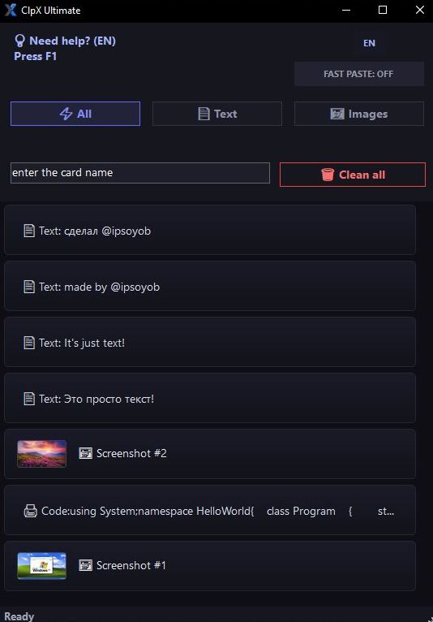
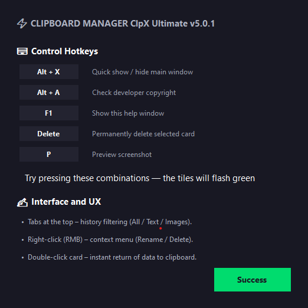
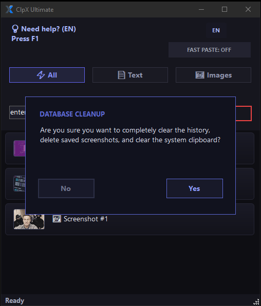
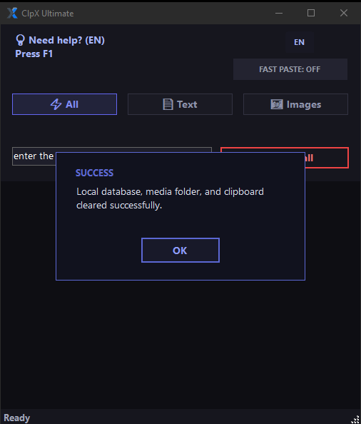
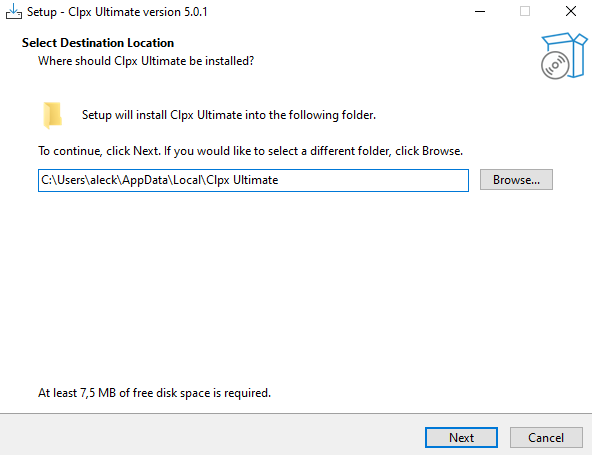
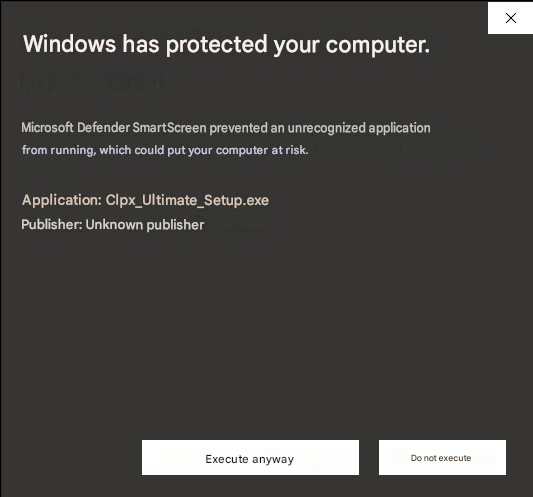

# 🚀 ClpX Ultimate | Smart Clipboard Manager

  <strong>🇷🇺 Современный, быстрый и безопасный менеджер буфера обмена с графическим интерфейсом для Windows.</strong> 
  <strong>🇺🇸 A modern, fast, and secure clipboard manager with a graphical interface for Windows.</strong>

---

## ✨ Основные фичи / Key Features
### 🇷🇺 На русском:
* **🎨 Стильный GUI-интерфейс:** Современная темная тема, созданная для удобства обычных пользователей. Интерфейс не перегружает глаза при долгой работе.
* **📂 Умная сортировка:** Разделение истории на вкладки `Всё` (All), `Текст` (Text) и `Картинки` (Images) для моментального переключения.
* **🧠 Распознавание типов данных:** Программа автоматически распознает, что вы скопировали — обычный текст, скриншот (с генерацией удобного превью) или исходный код (выделяется отдельной иконкой терминала).
* **⚡ Быстрая вставка (Fast Paste):** Специальный переключаемый режим для мгновенной потоковой вставки нужного элемента в один клик.
* **🔍 Мгновенный поиск:** Удобное поле поиска по названиям карточек и содержимому буфера для экономии вашего времени.
* **🌐 Мультиязычность:** Полная поддержка русского (RU) и английского (EN) интерфейсов, переключаемая прямо в главном окне.

---

### 🇺🇸 In English:
* **🎨 Sleek GUI Interface:** A modern dark theme designed for casual users and developers. Easy on the eyes during long working hours.
* **📂 Smart Categorization:** Instantly filter your history using the `All`, `Text`, and `Images` tabs.
* **🧠 Data Type Recognition:** Automatically detects what you copied — plain text, screenshots (with automatic thumbnail generation), or source code (marked with a distinctive terminal icon).
* **⚡ Fast Paste Toggle:** A dedicated clipboard streaming mode for lightning-fast, one-click insertions.
* **🔍 Instant Search:** Quickly find any item by its card name or content using the built-in search bar.
* **🌐 Multi-language Support:** Full native support for Russian (RU) and English (EN) interfaces, switchable on the fly.
# 🛠️ Установка и запуск / Installation & Usage

### 🇷🇺 На русском:
1. Перейдите в раздел **Releases** на странице этого репозитория.
2. Скачайте официальный установщик `ClpX_Ultimate_Setup.exe`.
3. Запустите инсталлятор. 
4. ⚠️ **Важно:** Так как у программы нет платной цифровой подписи разработчика, Windows SmartScreen может заблокировать запуск. Нажмите **«Подробнее» (More info)** ➔ **«Выполнить в любом случае» (Run anyway)**. Программа полностью безопасна и работает локально.
5. Следуйте простым шагам на экране и нажмите **F1** внутри приложения для вызова интерактивной справки!

---

### 🇺🇸 In English:
1. Navigate to the **Releases** tab on this repository.
2. Download the official installer named `ClpX_Ultimate_Setup.exe`.
3. Run the setup wizard.
4. ⚠️ **Important:** Since the app doesn't have a costly paid digital certificate, Windows SmartScreen might flag the installer. Click **"More info"** ➔ **"Run anyway"**. The program is fully safe, open-source, and offline.
5. Follow the quick installation steps and press **F1** inside the app to access the user guide!

---

## ⌨️ Управление и горячие клавиши / Controls & Hotkeys

### 🇷🇺 На русском:
* **`Alt + X`** — Быстрый вызов / скрытие главного окна программы из любого места.
* **`Alt + A`** — Проверка авторских прав разработчика.
* **`F1`** — Вызов интерактивного окна справки (с визуальной проверкой нажатия клавиш — плашки загораются зеленым!).
* **`Delete`** — Безвозвратное удаление выбранной карточки из истории.
* **`P`** — Быстрый предпросмотр скриншота в полном размере.

**🖱️ Интерфейс и UX:**
* **Двойной щелчок (ЛКМ) по карточке** — Мгновенный возврат выбранных данных в системный буфер обмена Windows.
* **Правый клик (ПКМ)** — Вызов контекстного меню для индивидуального управления карточкой (Переименовать / Удалить).

---

### 🇺🇸 In English:
* **`Alt + X`** — Toggle main window visibility (Show/Hide instantly from anywhere).
* **`Alt + A`** — Check developer's copyrights.
* **`F1`** — Open the interactive Help window (with real-time keypress validation — tiles light up green!).
* **`Delete`** — Permanently delete the selected clipboard card.
* **`P`** — Instant screenshot preview in full size.

**🖱️ UI & UX Gestures:**
* **Double-Click (LMB) on a card** — Instantly push the item back to the active Windows clipboard.
* **Right-Click (RMB)** — Open the context menu to Rename or Delete a specific card.

---

## 🔒 Безопасность и Конфиденциальность / Privacy & Security

### 🇷🇺 На русском:
**ClpX Ultimate** полностью автономен и заботится о конфиденциальности ваших данных:
* **💾 Локальное хранение:** Все данные сохраняются только на вашем компьютере (в локальной базе данных и папке `media`). Никакие данные не отправляются в облако.
* **🛡️ Подтверждение действий:** Защита от случайных нажатий — перед полной очисткой программа всегда запрашивает подтверждение через модальное окно.
* **🧹 Тотальное удаление:** При очистке история в локальной БД обнуляется, файлы кэша из папки `media` физически удаляются, а системный буфер обмена Windows очищается полностью. Статус-бар мгновенно уведомляет об успехе.

---

### 🇺🇸 In English:
**ClpX Ultimate** operates fully offline and keeps your data strictly confidential:
* **💾 Local Storage:** Your history is kept locally on your PC (inside a secure local database and a dedicated `media` folder). Zero cloud tracking or telemetry.
* **🛡️ Safe Warnings:** A modal prompt protects you from wiping your data by accident before execution.
* **🧹 Deep Clean:** Clearing your history triggers a full sweep — it wipes the local DB, physically removes cache files from the `media` folder, and empties the native Windows clipboard. The status bar immediately confirms the operation.

---

## 🖥️ Скриншоты интерфейса / Interface Screenshots

  

  <strong>🇷🇺 Главное окно / 🇺🇸 Main Window</strong>

 

  

  <strong>🇷🇺 Меню справки / 🇺🇸 Help Menu</strong>

 

  

  <strong>🇷🇺 Подтверждение очистки / 🇺🇸 Clear Confirmation</strong>

 

  

  <strong>🇷🇺 Успешная очистка / 🇺🇸 Clear Success</strong>

 

  

  <strong>🇷🇺 Окно установки / 🇺🇸 Installer Window</strong>

  

  <strong>🇷🇺 Предупреждение SmartScreen / 🇺🇸 SmartScreen Warning</strong>

---

## 🛠️ Установка и запуск / Installation & Usage

### 🇷🇺 На русском:
1. Перейдите в раздел **Releases** на странице этого репозитория.
2. Скачайте последнюю стабильную версию (архив или установщик).
3. Запустите `ClpX Ultimate.exe`.
4. Нажмите **F1** прямо внутри программы, чтобы открыть интерактивный гид по управлению!

### 🇺🇸 In English:
1. Navigate to the **Releases** tab on this repository.
2. Download the latest stable version (archive or installer).
3. Launch `ClpX Ultimate.exe`.
4. Press **F1** inside the app to access the interactive user guide!

---

## 🧑‍💻 Разработчик / Creator

Made with ❤️ by **[@ipsoyob](https://github.com)**  and @kl0pka
* 🇷🇺 Если вам понравился проект и он оказался полезным, не забудьте поставить **Star ⭐** этому репозиторию!
* 🇺🇸 If you like this project and find it useful, please consider giving it a **Star ⭐**!
